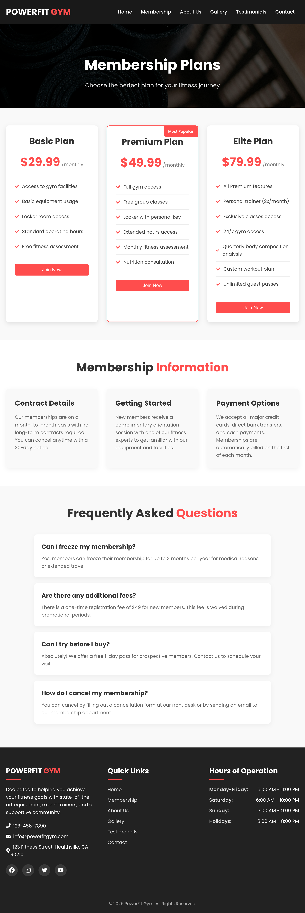

# 🏋️ GymX - Modern Gym Website

A simple, visually appealing gym website built with **React.js**. The website is fully responsive and optimized for user experience on both desktop and mobile devices.

## 🚀 Features
- 🏠 **Home Page** – Introduction to the gym and main services.
- 💳 **Membership Page** – Clear, user-friendly layout with membership plans.
- 🔍 **About Us** – Learn about the gym’s mission, values, and team.
- 📩 **Contact Us** – Form for customers to get in touch.
- 🖼️ **Gallery** – Showcasing gym facilities, workouts, and sessions.
- ⭐ **Testimonials** – Featuring customer feedback to build trust.
- 📱 **Responsive Design** – Works perfectly on mobile, tablet, and desktop.

## 🛠️ Tech Stack
- **Frontend:** React.js, React Router
- **Styling:** Tailwind CSS / CSS Modules
- **Deployment:** Vercel / Netlify

## 📸 Screenshots
### 🏠 Home Page  


### 💳 Membership Page  


## 🏗️ Installation & Usage

1. **Clone the Repository**
   ```sh
   git clone https://github.com/del-alj/gymx-website.git
   cd gymx-website

2. **Install Dependencies**

    ```sh
    npm install

3. **Run the App**

    ```sh
    npm start

4. **Build for Production**

    ```sh
    npm run build

**📬 Contact**
For any questions or feedback, reach out via:

📧 Email: elalj.douae@gmail.com

🔗 LinkedIn (https://www.linkedin.com/in/douae-el-alj/)